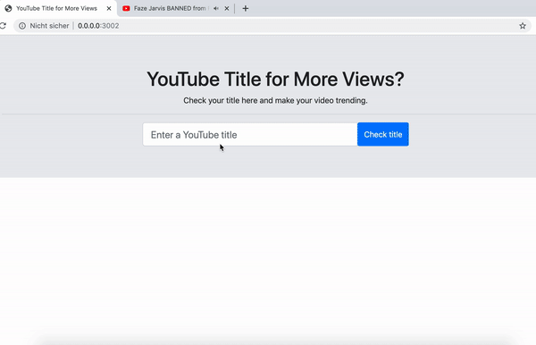

# Check Your YouTube Trending Potential - Natural Language Processing App
1. Motivation for the project: YouTube maintains a list of the top trending videos on the platform. For some videos it is predictable to become trending like a new song from a popular interpreter, or a new movie trailer. For other videos, the trends can be surprising. In this project, we build an app that rates a new video title trending potential. To do this, first we explore trending videos in a period of six months, second we process YouTube titles with natural language algortihms and third we create a machine learning model. At the end we implement a Flask app, that rates a new video title on a trending scale.

2. Results: The following demo shows, how the app works:  
<div style = "display: flex; justify-content: center">

</div>

<br>

# Project Components
## Most relevant files
- `YouTubeTrends.ipynb` - Jupyter notebook that contains the data processing. It creates a ML model, which we use to run the app.
- `run.py` - a file to run the app, that rates a new video YouTube title on a trending scale.

# Libraries
- plotly
- pandas
- joblib
- pickle
- sklearn
- nltk
- sqlalchemy
- re
- sys
- flask


## Project structure

```
- app
| - data # output data from notebook
| |- USvideos.db # processed data saved to database
| |- model.pkl  # ML final model file
|
| - templates
| |- master.html  # main page of web app
| |- go.html  # shows the results from the ML model
|- run.py  # Flask file that runs app

- notebook
|- USvideos.csv # six months of U.S. trending data from YouTube
|- YouTubeTrends.ipynb  # Jupyter notebook
|- YouTubeTrends.pdf # Write-up of the Juypter notebook

- media
|- trailer.gif #  App trailer

- README.md

```

# Instructions:
1. Run the following command in the app's directory to run your web app.
    `python run.py`

3. Go to http://0.0.0.0:3000/


# Licensing, Authors, and Acknowledgements
Data comes frome [kaggle](https://www.kaggle.com/datasnaek/youtube-new). Thanks to [Udacity](https://www.udacity.com/courses/all) for creating a beautiful learning experience. 